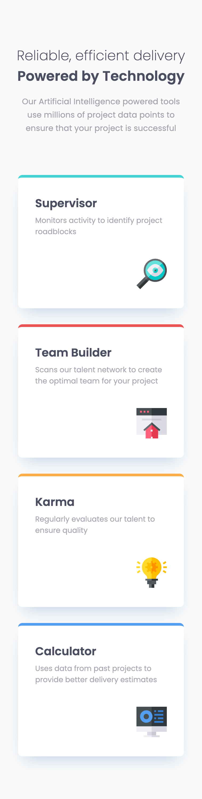
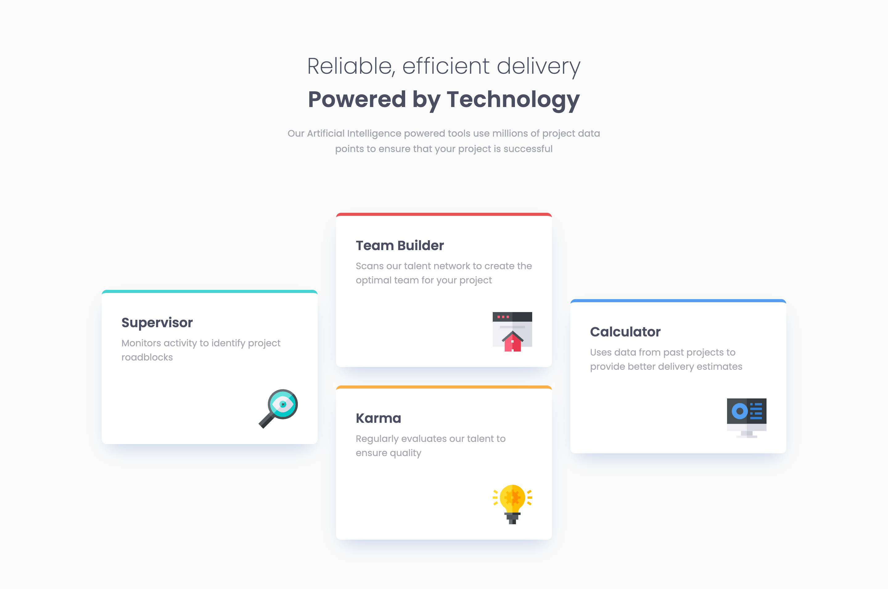

# Frontend Mentor - Four card feature section solution

This is a solution to the [Four card feature section challenge on Frontend Mentor](https://www.frontendmentor.io/challenges/four-card-feature-section-weK1eFYK). Frontend Mentor challenges help you improve your coding skills by building realistic projects.

## Table of contents

- [Overview](#overview)
  - [The challenge](#the-challenge)
  - [Screenshot](#screenshot)
  - [Links](#links)
- [My process](#my-process)
  - [Built with](#built-with)
  - [What I learned](#what-i-learned)
- [Author](#author)
- [Acknowledgments](#acknowledgments)

## Overview

Four Card Feature Challenge

### The challenge

Users should be able to:

- View the optimal layout for the site depending on their device's screen size

### Screenshot

### Links

- Solution URL: [https://github.com/andreaslarssamils/four-card-feature-section](https://github.com/andreaslarssamils/four-card-feature-section)
- Live Site URL: [https://andreaslarssamils.github.io/four-card-feature-section/](https://andreaslarssamils.github.io/four-card-feature-section/)

## My process

Ive used ordinary HTML CSS and FLEXBOX

### Built with

- HTML5
- CSS
- Flexbox

### What I learned

Ive reinforced my HTML CSS skills together with flexbox.

## Author

- Frontend Mentor - [@yourusername](https://www.frontendmentor.io/profile/yourusername)

## Acknowledgments

Thank you Frontend Mentor
